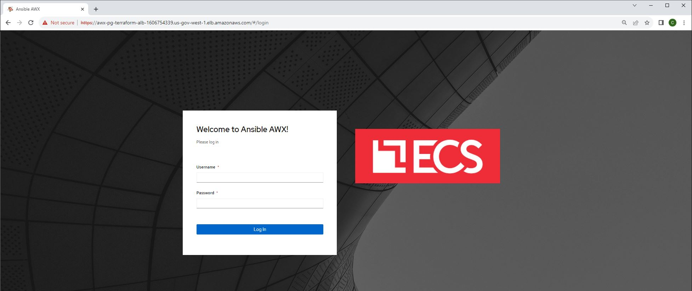

* This repository contains detailed instructions for deploying a RHEL 8 AWX EC2 instance using Terraform. The deployment includes creating EC2 instances, Application Load Balancer (ALB), Security Groups (SG) for EC2 and ALB, managing certificates, and setting up a target group. Once the infrastructure is in place, the guide will walk you through the process of deploying AWX on the EC2 instance deployed via Terraform. For any additional details or inquiries, please contact us at c.sargent-ctr@ecstech.com.
# [AWX Project Page](https://github.com/ansible/awx)
* Note AWX is the opensourced Ansible Automation Platform
# [Ansible Automation Plaform](https://www.redhat.com/en/technologies/management/ansible)

# Clone project and terraform deploy
1. ssh -i alpha_key_pair.pem ec2-user@PG-TerraformPublicIP
2. cd /home/christopher.sargent/ && git clone https://bitbucket.cdmdashboard.com/projects/DBOPS/repos/awx_terraform_pg.git
3. cd awx_terraform_pg/ && vim providers.tf
```
# Playground
provider "aws" {
  region = var.selected_region
  access_key = var.aws_access_key
  secret_key = var.aws_secret_key
}
```
4. vim alpha_key_pair.pem
```
# alpha_key_pair.pem.pem key is in AWS secrets manager in playground. Cut and paste key into this file and save
```
5. chmod 400 alpha_key_pair.pem
6. vim variables.tf
```
Playground terraform_service_user aws_access_key and aws_secret_key is in AWS secrets manager
variable "aws_access_key" {
  type    = string
  default = "" # specify the access key
}
variable "aws_secret_key" {
  type    = string
  default = "" # specify the secret key
}
variable "selected_region" {
  type    = string
  default = "us-gov-west-1" # specify the aws region
}
# aws ssh key
variable "ssh_private_key" {
  default         = "alpha_key_pair.pem"
  description     = "alpha_key_pair"
}
```
7. terraform init && terraform plan --out awx.out
8. terraform apply "awx.out"
9. https://console.amazonaws-us-gov.com > EC2 > search for awx-pg-terraform-ec2 and verify instance is up


10. https://console.amazonaws-us-gov.com > Load Balancers > search for awx-pg-terraform-alb and get DNS name


11. https://DNSnamefromstep10 > Login to AWX
# Update resources names if needed
* Note. This is only needed if deploying additional resources.
1. ssh -i alpha_key_pair.pem ec2-user@PG-TerraformPublicIP
2. sudo -i
3. cd /home/christopher.sargent/ecs_threatq_terraform_ps
4. cp main.tf main.tf.BAK
5. sed -i -e 's|terraform|terraform01|g' main.tf
```
The resources are now named

awx-pg-terraform01-ec2 and awx-pg-terraform01-alb

versus

awx-pg-terraform-ec2 and awx-pg-terraform-alb
```
# Terraform destroy if needed
* Note. This is only if AWX is no longer needed.
1. ssh -i alpha_key_pair.pem ec2-user@PG-TerraformPublicIP
2. sudo -i
3. cd /home/christopher.sargent/awx_terraform_pg
4. terraform destroy

# AWX Prerequisites
* Install EPEL, docker, docker-compose on EC2 deployed from terraform
* Note docker and docker-compose were installed on the AMI already via the steps below
1. ssh -i alpha_key_pair.pem ec2-user@PG-TerraformPublicIP
2. sudo -i
3. cd /home/sysadmin && ssh -i alpha_key_pair.pem ec2-user@awx-pg-terraform-ec2PrivateIP
4. sudo -i
5. dnf upgrade -y && dnf install yum-utils -y && reboot
6. steps 1 - 4 under Deploy AWX 21.11.1 on awx-pg-terraform-ec2
7. dnf install https://dl.fedoraproject.org/pub/epel/epel-release-latest-8.noarch.rpm -y && dnf update && dnf install htop -y
8. cp /etc/profile /etc/profile.ORIG && echo "export PROMPT_COMMAND='echo -n \[\$(date +%F-%T)\]\ '" >> /etc/profile && echo "export HISTTIMEFORMAT='%F-%T '" >> /etc/profile && source /etc/profile
9. dnf install git gcc gcc-c++ nodejs gettext device-mapper-persistent-data lvm2 bzip2 python3-pip ansible vim -y
10. dnf config-manager --add-repo=https://download.docker.com/linux/centos/docker-ce.repo
11. dnf install --nobest --allowerasing docker-ce -y
12. curl -SL https://github.com/docker/compose/releases/download/v2.3.3/docker-compose-linux-x86_64 -o /usr/local/bin/docker-compose && chmod +x /usr/local/bin/docker-compose && ln -s /usr/local/bin/docker-compose /usr/bin/docker-compose
13. docker --version && docker-compose --version
```
Docker version 24.0.5, build ced0996
Docker Compose version v2.3.3
```
14. systemctl enable docker.service && systemctl start docker.service
# Git Clone AWX
* Git clone AWX 21.11.1 on awx-pg-terraform-ec2, configure project, build images and deploy AWX containers
1. ssh -i alpha_key_pair.pem ec2-user@PG-TerraformPublicIP
2. sudo -i
3. cd /home/sysadmin && ssh -i alpha_key_pair.pem ec2-user@awx-pg-terraform-ec2PrivateIP
4. sudo -i
6. cd /home && git clone -b 21.11.0 https://github.com/ansible/awx.git
7. cd /home && mv awx awx21 && cd /home/awx21/tools/docker-compose
8. vim inventory
```
# Uncomment and update pg_password, broadcast_websocket_secret, secret_key and awx_image
localhost ansible_connection=local ansible_python_interpreter="/usr/bin/env python3"

[all:vars]

# AWX-Managed Database Settings
# If left blank, these will be generated upon install.
# Values are written out to tools/docker-compose/_sources/secrets/
pg_password="password"
broadcast_websocket_secret="password40"
secret_key="passwordpasswordpasswordpassword"

# External Database Settings
# pg_host=""
# pg_password=""
# pg_username=""
# pg_hostname=""

awx_image="ghcr.io/ansible/awx_devel"
# migrate_local_docker=false

```
* Note the following take a few minutes each
9. cd /home/awx21 && cp tools/ansible/roles/dockerfile/templates/Dockerfile.j2 tools/ansible/roles/dockerfile/templates/Dockerfile.j2.ORIG
* Note you need to update rsyslog-8.2102.0-106.el9 to rsyslog which should be line 119
10. sed -i -e 's|rsyslog-8.2102.0-106.el9|rsyslog|g' /home/awx21/tools/ansible/roles/dockerfile/templates/Dockerfile.j2
11. make docker-compose-build
12. docker image ls
```
REPOSITORY                  TAG       IMAGE ID       CREATED         SIZE
ghcr.io/ansible/awx_devel   HEAD      847988a0e898   2 minutes ago   1.82GB
quay.io/centos/centos       stream9   7a8f9253940e   3 days ago      155MB

```
13. cd /home/awx21 && make docker-compose COMPOSE_UP_OPTS=-d

14. docker exec tools_awx_1 make clean-ui ui-devel
15. docker exec -ti tools_awx_1 awx-manage createsuperuser
* Note to store these creds in secrets manager root password
```
Username (leave blank to use 'root'):
Email address: christ.sargent-CTR@ecstech.com
Password:
Password (again):
Superuser created successfully.

```
16. cp /root/.bashrc /root/.bashrc.ORIG
17. vi /root/.bashrc (add the following aliases)
```
alias awx-start='cd /home/awx21/tools/docker-compose/_sources && docker-compose up -d'
alias awx-stop='cd /home/awx21/tools/docker-compose/_sources && docker-compose down'
alias awx='cd /var/lib/awx/projects/'
```
18. source /root/.bashrc
19. awx-stop
```
[+] Running 4/4
 ⠿ Container tools_awx_1       Removed                                                                                                                                                                  3.7s
 ⠿ Container tools_redis_1     Removed                                                                                                                                                                  0.3s
 ⠿ Container tools_postgres_1  Removed                                                                                                                                                                  0.2s
 ⠿ Network sources_default     Removed
```
20. vim /home/awx21/tools/docker-compose/_sources/docker-compose.yml
* Note we are adding the bind mount - "/var/lib/awx/projects:/var/lib/awx/projects:rw", setting restart: always so the containers come back up on reboot and updating the ports from 8043:8043 to 443:8043
```
---
version: '2.1'
services:
  # Primary AWX Development Container
  awx_1:
    user: "0"
    image: "ghcr.io/ansible/awx_devel:HEAD"
    container_name: tools_awx_1
    restart: always
    hostname: awx_1
    command: launch_awx.sh
    environment:
      OS: " Operating System: Red Hat Enterprise Linux 8.7 (Ootpa)"
      SDB_HOST: 0.0.0.0
      SDB_PORT: 7899
      AWX_GROUP_QUEUES: tower
      MAIN_NODE_TYPE: "${MAIN_NODE_TYPE:-hybrid}"
      RECEPTORCTL_SOCKET: /var/run/awx-receptor/receptor.sock
      CONTROL_PLANE_NODE_COUNT: 1
      EXECUTION_NODE_COUNT: 0
      AWX_LOGGING_MODE: stdout
      DJANGO_SUPERUSER_PASSWORD: hRBCGBMkDmDRPPGtMpin
      RUN_MIGRATIONS: 1
    links:
      - postgres
      - redis_1
    working_dir: "/awx_devel"
    volumes:
      - "../../../:/awx_devel"
      - "../../docker-compose/supervisor.conf:/etc/supervisord.conf"
      - "../../docker-compose/_sources/database.py:/etc/tower/conf.d/database.py"
      - "../../docker-compose/_sources/websocket_secret.py:/etc/tower/conf.d/websocket_secret.py"
      - "../../docker-compose/_sources/local_settings.py:/etc/tower/conf.d/local_settings.py"
      - "../../docker-compose/_sources/SECRET_KEY:/etc/tower/SECRET_KEY"
      - "../../docker-compose/_sources/receptor/receptor-awx-1.conf:/etc/receptor/receptor.conf"
      - "../../docker-compose/_sources/receptor/receptor-awx-1.conf.lock:/etc/receptor/receptor.conf.lock"
      # - "../../docker-compose/_sources/certs:/etc/receptor/certs"  # TODO: optionally generate certs
      - "/sys/fs/cgroup:/sys/fs/cgroup"
      - "~/.kube/config:/var/lib/awx/.kube/config"
      - "redis_socket_1:/var/run/redis/:rw"
      - "/var/lib/awx/projects:/var/lib/awx/projects:rw"
    privileged: true
    tty: true
    ports:
      - "7899-7999:7899-7999"  # sdb-listen
      - "6899:6899"
      - "8080:8080"  # unused but mapped for debugging
      - "8888:8888"  # jupyter notebook
      - "8013:8013"  # http
      - "443:8043"  # https
      - "2222:2222"  # receptor foo node
      - "3000:3001"  # used by the UI dev env
  redis_1:
    image: redis:latest
    container_name: tools_redis_1
    restart: always
    volumes:
      - "../../redis/redis.conf:/usr/local/etc/redis/redis.conf"
      - "redis_socket_1:/var/run/redis/:rw"
    entrypoint: ["redis-server"]
    command: ["/usr/local/etc/redis/redis.conf"]
  # A useful container that simply passes through log messages to the console
  # helpful for testing awx/tower logging
  # logstash:
  #   build:
  #     context: ./docker-compose
  #     dockerfile: Dockerfile-logstash
  postgres:
    image: postgres:12
    container_name: tools_postgres_1
    restart: always
    # additional logging settings for postgres can be found https://www.postgresql.org/docs/current/runtime-config-logging.html
    command: postgres -c log_destination=stderr -c log_min_messages=info -c log_min_duration_statement=1000 -c max_connections=1024
    environment:
      POSTGRES_HOST_AUTH_METHOD: trust
      POSTGRES_USER: awx
      POSTGRES_DB: awx
      POSTGRES_PASSWORD: 31nst31n
    volumes:
      - "awx_db:/var/lib/postgresql/data"

volumes:
  awx_db:
    name: tools_awx_db
  redis_socket_1:
    name: tools_redis_socket_1
```
21. awx-start
```
[+] Running 4/4
 ⠿ Network sources_default     Created                                                                                                                                                                  0.1s
 ⠿ Container tools_redis_1     Started                                                                                                                                                                  0.8s
 ⠿ Container tools_postgres_1  Started                                                                                                                                                                  0.8s
 ⠿ Container tools_awx_1       Started
```
22. https://awx-pg-terraform-alb-1606754339.us-gov-west-1.elb.amazonaws.com > Login to AWX


