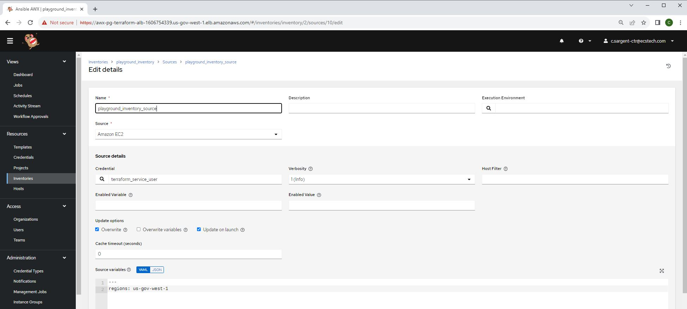

* This repository contains detailed instructions for configuring AWX for use. For any additional details or inquiries, please contact us at c.sargent-ctr@ecstech.com.

# [AWX Project Page](https://github.com/ansible/awx)
* Note AWX is the opensourced Ansible Automation Platform
# [Ansible Automation Plaform](https://www.redhat.com/en/technologies/management/ansible)

# Configure Organization
1. https://awx-pg-terraform-alb-1606754339.us-gov-west-1.elb.amazonaws.com > Login to AWX

2. Access > Organizations > Add 

3. Name = ECS > Save

# Configure Credentials
1. https://awx-pg-terraform-alb-1606754339.us-gov-west-1.elb.amazonaws.com > Login to AWX

2. Resources > Credentials > Add 

3. Name = terraform_service_user > Credential Type = Amazon Wed Services > Organization = ECS > Add Access Key and Secret Key > Save

# Configure Inventory Sync
1. https://awx-pg-terraform-alb-1606754339.us-gov-west-1.elb.amazonaws.com > Login to AWX

2. Resources > Inventories > Add > Add inventory

3. Name = playground_inventory > Organization = ECS > Save

4. Resources > Inventories > playground_inventory > Sources > Add 

5. Name = playground_inventory_source > Credential = terraform_service_user > Select Overwrite > Select Update on launch > Add regions: us-gov-west-1 to source variables

6. Resources > Inventories > playground_inventory > Sources > Sync 

7. Resources > Inventories > playground_inventory > Hosts > Verify hosts are populated

#

